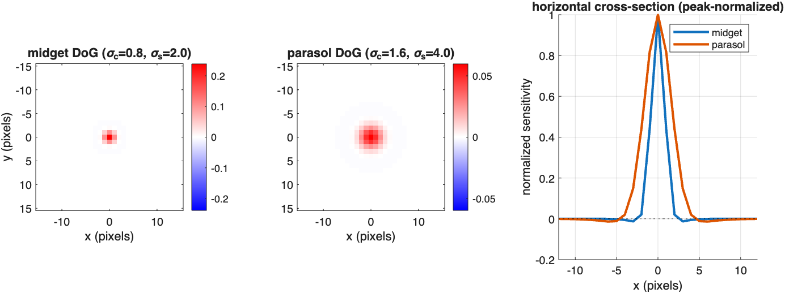
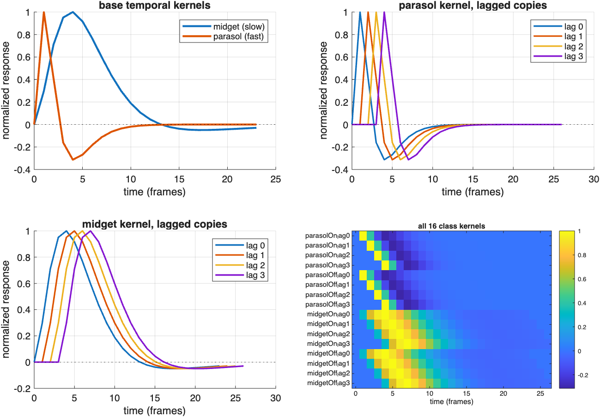
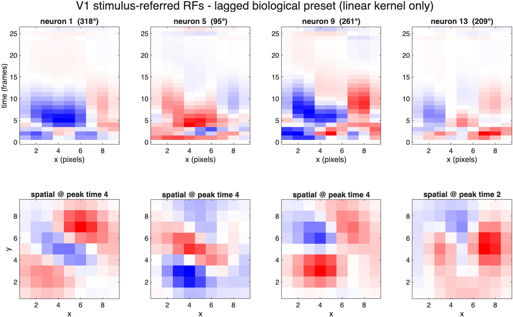
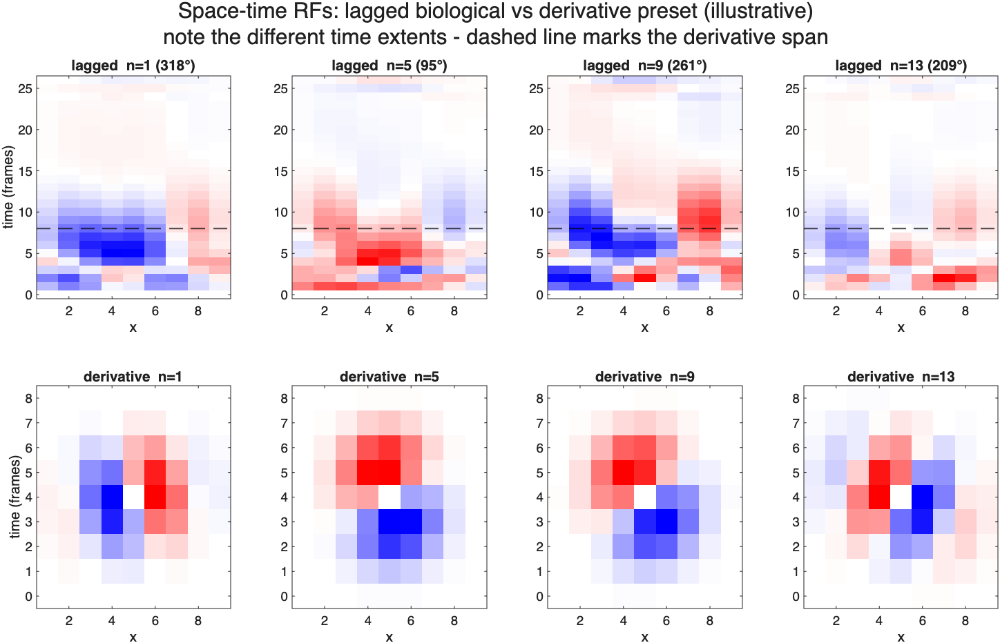

# The lagged midget/parasol preset — a plain-language summary

**File:** `pars/shRgcClassesMidgetParasolLagged.m`
**Status:** the adopted biological front-end (since the 2026-07-12 scope pivot,
`RGC_V1_unification_plan.md` §3.5). It replaces the offset+quadrature preset now
archived in `explore/_archive/`.

Figures in this document are generated by
`explore/makeLaggedPresetDocFigures.m` (writes to `docs/figures/`).

---

## 1. What it is

The original Simoncelli–Heeger (SH) model feeds V1 from an abstract mathematical
basis: spatial derivatives of a filtered image, orders 0–3. This preset replaces
that front-end with something you could point at in a retina — populations of
**retinal ganglion cells (RGCs)** — while still driving the same V1 stage.

It defines RGC populations along three crossed factors:

| factor | levels | what distinguishes them |
|---|---|---|
| **cell type** | midget, parasol | RF size and speed: parasol big+fast, midget small+slow |
| **polarity** | ON, OFF | ON fires to brightness increases, OFF to decreases |
| **lag** | 0, 1, 2, 3 frames | identical cells whose responses arrive at staggered delays |

2 × 2 × 4 = **16 classes**. Each feeds all 10 of V1's spatial-derivative
read-outs, giving a **160-feature** basis, combined into neuron responses by a
numerically fitted weight matrix (`pars.rgc.combine = 'weights'`,
`shFitClassV1Weights`).

> **Terminology.** "**Lag**" in this repo means *only* the population delays above —
> the 4 values 0–3 that define the lagged copies. The time axis of a receptive
> field or kernel plot is called "**time**", never "lag". (These were previously
> conflated, including in `shV1Rf`'s header; both now use `time`.)

Two things it deliberately does **not** do, both inherited from the pivot:

- **No ON/OFF spatial offset**, and **no ON quadrature kernel.** The earlier preset
  used these to build direction selectivity in the retina; that mechanism distorted
  V1 orientation tuning and fought the read-out. Here direction selectivity comes
  from the SH steerable V1 read-out, exactly as in the derivative preset.
- **No exotic cell types.** Every channel stays a plain mono/biphasic
  centre-surround cell. All the temporal sophistication lives in the *combination*
  of lagged copies, not in any single cell.

---

## 2. Spatial receptive fields



Each class has a **difference-of-Gaussians (DoG)** receptive field: an excitatory
centre minus a broader inhibitory surround. Parasol cells are twice the size of
midgets in both components (centre σ 1.6 vs 0.8 px; surround σ 4.0 vs 2.0 px).
ON and OFF classes share the *same* RF — they differ only in which half of the
rectified signal they keep.

The panels above plot the true impulse response of the DoG the model actually
applies (`localDoG` in `shClassV1Basis.m`), which builds the Gaussians with
`mkGaussianFilter` — **sum-normalized** and truncated at 3σ.

> **Observation worth flagging.** The surround is very weak. Integrating the
> impulse response, the negative lobe is only about **12–13% of the positive lobe**
> (midget 0.124, parasol 0.132), because `surroundWeight` is 0.25 and the surround
> is spread over a much larger area. Real midget and parasol cells have surrounds
> that are a substantial fraction of centre strength — commonly cited integrated
> surround:centre ratios are far higher than 0.13. These RFs are therefore close to
> plain low-pass centres with a slight edge enhancement, not strongly
> band-pass centre-surround filters. If the surround is meant to do real work
> (contrast normalization, low-frequency attenuation), `surroundWeight` likely
> needs revisiting.

---

## 3. Temporal kernels, and what the lags are for



Each class's temporal kernel is a **difference of gamma functions** — a biphasic
impulse response: an initial excursion that overshoots and rebounds with opposite
sign. Parasol is fast (peak ~1 frame, τ 0.6/1.2); midget is slow (peak ~4 frames,
τ 2.0/4.0). Both run 24 frames.

**The lags are the defining idea of this preset.** A lagged copy is the same kernel
zero-padded by *d* frames (top-right and bottom-left panels). Nothing about the
cell changes — only when its response arrives.

Why that matters: SH's V1 stage wants temporal channels up to 3rd order, which
behave like successive time-derivatives. A single mono- or biphasic RGC cannot
supply a 3rd-order temporal channel. But **a weighted difference of the same kernel
at staggered lags approximates a derivative** — the same trick as a finite
difference. So the high-order temporal structure is synthesized in the *linear
combination* downstream, while every individual channel stays physiologically
plausible.

The bottom-right panel shows all 16 kernels as a bank. Note that the ON and OFF
rows are identical: polarity is imposed by rectification after spatial filtering,
not by a different kernel.

---

## 4. The V1 receptive fields this produces



Top row: the **space–time** receptive field (a horizontal slice through the RF,
x against time) for four V1 neurons with different preferred directions. Red is
excitatory, blue inhibitory, symmetric colour limits per panel.

The signature of direction selectivity is the **tilt** — excitatory and inhibitory
lobes displaced in *both* space and time, so the neuron prefers a stimulus arriving
at one location and then another. Neurons 1 and 9 (318° and 261°) show clearly
opposed tilts. Bottom row: the spatial RF at each neuron's peak-energy time, showing
oriented ON/OFF subregions.

> **Caveat.** `shV1Rf` returns the **linear** stimulus-referred kernel. For a
> biological preset it convolves the class RFs and kernels with the read-out weights
> but *ignores the ON/OFF half-wave rectification*, which is nonlinear. These
> pictures are therefore the linear skeleton of the RF, not a complete description of
> what the model computes.

---

## 5. Comparison with the derivative (SH) preset



**Illustrative, not quantitative** — same four neurons, same slice, each panel
independently scaled.

What is shared: both presets produce **oriented, tilted space–time RFs** — the same
qualitative motion-selective structure, with matching tilt direction per neuron.
This is the point of the pivot: the biological front-end is not computing something
different, it is reaching a similar V1 RF by a different route.

What differs:

- **Temporal extent.** The derivative preset's RF spans 9 frames (SH's temporal
  filter length). The lagged biological RF spans ~27 and carries real structure out
  to ~15 frames. The dashed line marks the derivative's span for scale. The
  biological kernels are simply much longer-lived.
- **Compactness.** The derivative RF is a clean, near-textbook two-lobed tilted
  kernel. The biological one is coarser and has more scattered secondary structure —
  a consequence of assembling it from 16 fitted channels rather than deriving it
  analytically.

---

## 6. How well does it match?

The lagged preset reaches **~0.98 correlation with the legacy SH V1 output** on
held-out stimuli, versus ~0.68 for the retired offset+quadrature preset. From
`tests/testClassPathBiological.m` (fit on 6 stimuli, evaluated on 4 unseen ones):

| held-out stimulus | r |
|---|---|
| random dots, 45°, speed 0.9 | 0.955 |
| grating, 30°, sf 0.13 cyc/px, tf 0.17 cyc/frame | 0.998 |
| grating, 120°, sf 0.16 cyc/px, tf 0.15 cyc/frame | 0.988 |
| random dots, 180°, speed 0.6, contrast 0.8 | 0.934 |
| **pooled** | **0.984** |

Read that number with three qualifications:

1. **It is a match to the SH model, not to data.** The target is the legacy V1
   output, so this measures how well the biological front-end reproduces SH — not
   how well either reproduces a real V1 neuron.
2. **The pooled figure hides spread across neurons.** Per-neuron correlation has
   median 0.984 and max 0.997, but **minimum 0.709**. At least one direction fits
   substantially worse than the headline suggests.
3. **The samples are not independent.** Each stimulus yields 15,138 (y, x, t)
   locations — 29 × 29 × 18 after valid convolution — but neighbouring locations
   overlap heavily under 9-tap filters, so the effective *n* is far below the
   nominal 1.7 million paired values. Gratings also fit better than dots, which
   stress the temporal basis harder.

---

## 7. Known gaps

- **Frame rate — resolved, see §7.1 below.** This was the standing TODO from §2.4.
  The units *are* recoverable from the SH paper, and the resulting numbers raise
  real plausibility questions about the preset's parameters.
- **The surround is far weaker than real RGCs** (§2 above).
- **The lesion story is narrower than once claimed.** See design-discussion §16: a
  conduction-delay lesion is *not* something SH's basis cannot express, and in this
  lagged preset a delay is approximately a reweighting of the lag channels. A
  genuine biological-vs-SH non-vacuousness test — one exploiting the ON/OFF
  rectification that SH lacks — is still outstanding.

### 7.1 Physical units: pixels→degrees and frames→seconds

Simoncelli & Heeger (1998) **Appendix I, p. 761** fixes the units explicitly:

> frequency units are fixed so the peak of the annulus crosses the temporal
> frequency axis at ω_t = 8 cycles/sec and the spatial frequency axes at
> ω_x = 0.5 cycles/deg.

That pins *both* axes independently, so the mapping is fully determined. In this
codebase the 3rd-derivative spatial and temporal filters are the same shape, and
both peak at **0.2148 cycles/sample** — so the model's preferred speed is exactly
**1 pixel/frame**, which SH's convention makes 8 / 0.5 = **16 deg/sec**:

| quantity | value |
|---|---|
| 1 pixel | **0.430 deg** (25.8 arcmin), i.e. 2.33 pixels/deg |
| 1 frame | **26.9 ms**, i.e. **37.2 frames/sec** |
| 1 pixel/frame | **16 deg/sec** |

Cross-check: SH's own normalization pool is described as tuned to "moderate speeds
(16 deg/sec)" — matching the derived preferred speed exactly.

**What this implies for the biological preset** (and it is not all comfortable):

| parameter | in frames/pixels | in physical units | plausible? |
|---|---|---|---|
| parasol kernel peak | 1 frame | 27 ms | yes — real parasol peaks ~20–40 ms |
| midget kernel peak | 4 frames | 107 ms | slow; real midget is nearer 50–80 ms |
| midget sign reversal | 14 frames | 376 ms | very slow |
| kernel length | 24 frames | 645 ms | very long for an RGC impulse response |
| population lags 0–3 | 0–3 frames | 0, 27, 54, 81 ms | **too long for conduction delay** (a few ms), but in range for lagged LGN cells / delayed inhibition |
| parasol centre σ | 1.6 px | 0.69 deg | large — real parasol centres are ~0.1–0.2 deg outside the far periphery |
| midget centre σ | 0.8 px | 0.34 deg | **far too large** — real midget centres are ~0.02–0.05 deg |

Two honest readings of this. (a) The SH model simply operates at a coarse spatial
scale — 0.43 deg/pixel — so its "RGCs" are better understood as coarse-scale
channels than as individual ganglion cells, and matching single-cell RF sizes was
never on the cards. (b) If the biological front-end is meant to carry
cell-type-specific meaning (which is the whole point of the lesion programme), then
the midget/parasol size ratio is preserved but the absolute scale is off by roughly
an order of magnitude, and the "lags" are better justified as lagged LGN /
delayed inhibition than as optic-nerve conduction delay.

Either way the frame rate is now pinned: **~37 Hz, 26.9 ms/frame**, and the
temporal parameters can finally be checked against Kling (2020) time courses.

---

## 8. Reproducing the figures

```
matlab -batch "run('explore/makeLaggedPresetDocFigures.m')"
```

Reuses the cached weight fit in
`pars/shRgcClassesMidgetParasolLagged_v1Weights_lag0123.mat` when present,
otherwise refits and saves it.
